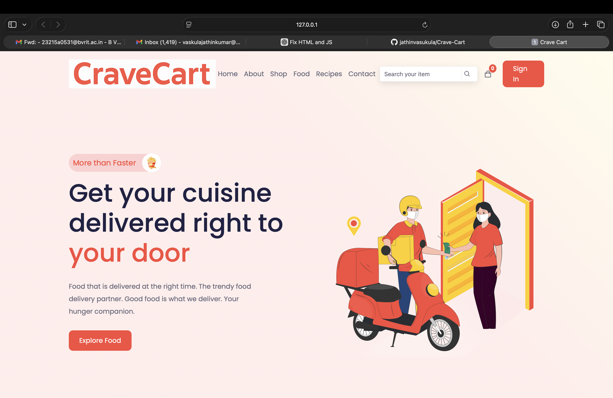

# 🍽️ CraveCart — Modern Food Ordering Web App

CraveCart is a clean, modern, and responsive food ordering web application built using HTML, CSS, and JavaScript.  
It showcases UI design, dynamic content loading, Swiper.js components, and an interactive cart system.

---

## 🚀 Live Demo  
(Enable GitHub Pages after upload)

👉 https://jathinvasukula.github.io/Crave-Cart/

---

## 📸 Screenshots  
(Add real screenshots inside `/images` and update these paths)

 Home Page 

 

---

## ⭐ Features

### 🍕 Dynamic Product System
- Loads products from `products.json`
- Category-based filtering  
- Uses Swiper.js slider

### 🛒 Cart System
- Add-to-cart button  
- Cart modal UI  
- Real-time cart badge updates  

### 👥 Testimonials Section
- Loads data from `testimonials.json`  
- Switchable user profiles  

### 🔐 UI Components
- Sign-in popup  
- Responsive navbar  
- Search bar  

### 📱 Responsive Design
- Works on mobile, tablet, and desktop

---

## 🧱 Project Structure

```
Crave-Cart/
│── index.html
│── README.md
│── LICENSE
│── .gitignore
│── products.json
│── testimonials.json
│
├── css/
│   └── styles.css
│
├── js/
│   └── main.js
│
└── images/
    ├── cravecart-logo.png
    ├── favicon-32x32.png
    ├── product images...
    ├── testimonial images...
    └── screenshots...
```

---

## 🧑‍💻 Tech Stack

### Frontend
- HTML5  
- CSS3  
- JavaScript (ES6)

### Libraries
- Swiper.js  
- Boxicons  
- Google Fonts (optional)  

---

## ⚙️ How to Run Locally

### 1️⃣ Clone the repo

```bash
git clone https://github.com/jathinvasukula/Crave-Cart
```

### 2️⃣ Open project folder

```bash
cd Crave-Cart
```

### 3️⃣ Run project

- Double-click `index.html`  
OR  
- Use VS Code Live Server  
OR  
- Run a local server:

```bash
python3 -m http.server
```

---

## 🌐 Deploy on GitHub Pages

1. Go to **Settings → Pages**
2. Under *Source* select:
   - Branch: `main`
   - Folder: `/ (root)`
3. Save

Your site will appear at:

```
https://jathinvasukula.github.io/Crave-Cart/
```

---

## 🤝 Contributing

Contributions are welcome!

1. Fork repo  
2. Create new branch  
3. Commit changes  
4. Push & create PR  

---

## 🧾 License

This project is licensed under the **MIT License**.

---

## 👨‍💻 Author

**Jathin Vasukula**  
GitHub: https://github.com/jathinvasukula

---

## ⭐ Support

If you like this project, please ⭐ star the repository!
